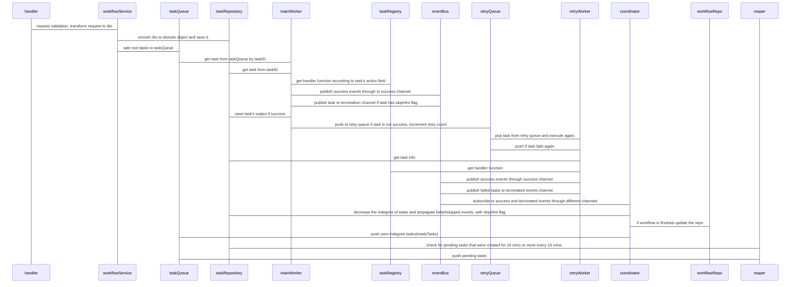

# Temporal Java

Temporal Java is a lightweight, workflow orchestration engine built in Java using Spring Boot. It provides a robust architecture for defining, executing, and managing complex, multi-step asynchronous workflows and tasks.

## Features

- **Workflow Orchestration**: Define and execute multi-step workflows.
- **Task Queuing & Execution**: Asynchronous task execution using main and retry queues.
- **Event-Driven Architecture**: Communication between components using an event bus.
- **Robust Retries**: Built-in retry mechanisms for failed tasks.
- **Task Reaping**: Automatic recovery of pending/stuck tasks.
- **Modular Design**: Built using Spring Modulith for clear logical boundaries.

## Technology Stack

- **Java**: 25
- **Framework**: Spring Boot 4.0.5, Spring Modulith
- **Persistence**: Spring Data JPA, Flyway for migrations
- **Caching & Sessions**: Redis
- **Message Broker & Queues**: RabbitMQ
- **Web**: Spring WebMVC, WebSockets, HTMX
- **API Documentation**: Springdoc OpenAPI
- **Observability**: Micrometer (Prometheus, Datadog)

## Architecture

The workflow execution relies on several components communicating to ensure reliability and fault tolerance.

### Execution Sequence

Below is the sequence diagram illustrating the lifecycle of a task and workflow within the system, based on the internal design specifications:



## Project Structure

The project is structured into distinct modules, adhering to Domain-Driven Design and Spring Modulith principles:

- **`api`**: Contains REST controllers, request validation, and transformation logic.
- **`config`**: Configuration classes for integrations like RabbitMQ.
- **`coordinator`**: Manages event subscriptions and coordinates state transitions (e.g., updating task dependencies).
- **`domain`**: Core domain models, entities, and value objects.
- **`queue`**: Task and retry queue interfaces and their implementations.
- **`repository`**: Data access layer for managing database operations for tasks and workflows.
- **`service`**: Core business logic layer, containing services like `WorkflowService`, `ReaperService`, and EventBus implementations.
- **`worker`**: Background processing components, including the main worker and retry worker, interacting with queues and the task registry.
- **`common`**: Shared utilities and cross-cutting concerns.

## Getting Started

*(Instructions for running the application, e.g., Docker Compose, Maven commands)*

1. Start dependencies (e.g., database, Redis) using Docker Compose:
   ```bash
   docker-compose up -d
   ```
2. Build and run the application using Maven:
   ```bash
   ./mvnw spring-boot:run
   ```
